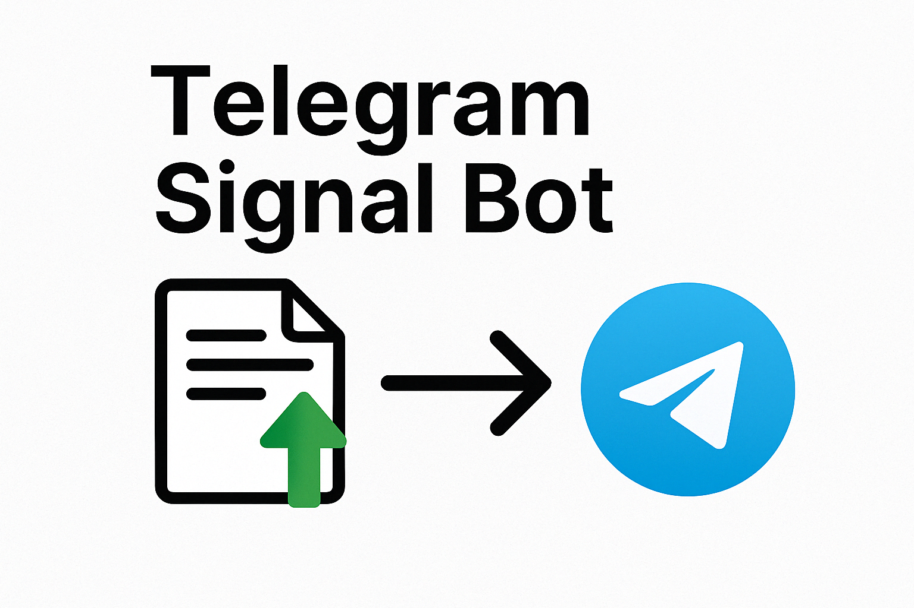

# Telegram Signal Bot 📲

This project implements a simple trading signal generator that responds to Telegram commands.

## 🚀 Features
- Generates trading signals based on SMA crossover.
- Sends signals via Telegram bot (`/signal` command).
- Parses local CSV data for demo purposes.

## 🧠 Strategy
If current price > SMA(5) → `BUY`  
If current price < SMA(5) → `SELL`  
Else → `HOLD`

## 📁 Structure
```
telegram_signal_bot/
│
├── bot.py                  ← Telegram bot logic
├── data/
│   └── sample_data.csv     ← Sample price data
└── README.md               ← This file
```

## 🖼 Preview


## ✅ How to Run
1. Replace `'YOUR_BOT_TOKEN_HERE'` with your bot token.
2. Run `python bot.py`
3. In Telegram, type `/start`, then `/signal`